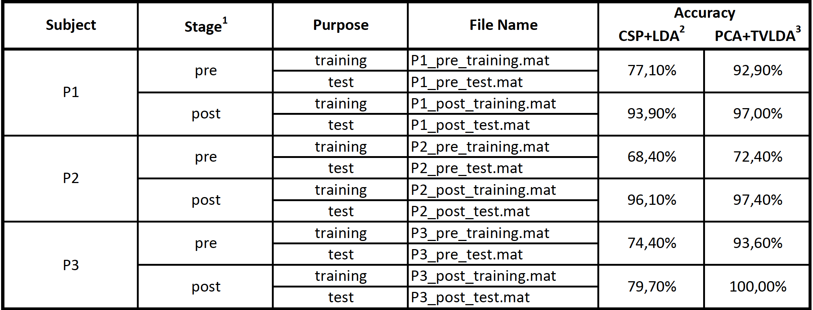

# G23_stroke_rehab
BR41N.IO HACKATHON 2024 

## EEG preprocessing
- filtering
  - Band pass filter (8-30 Hz)
- Epoching

## Feature extraction
- Common Spatial Pattern (CSP)
- Principal Component Analysis (PCA)

## Models
- Linear Discriminant Analysis (LDA)
- Support Vector Machine (SVM)
- TVlda

## Previous results
