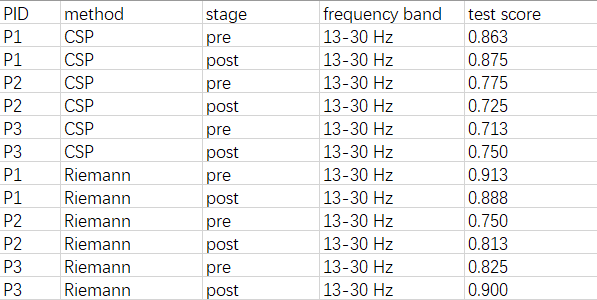

# G23_stroke_rehab
BR41N.IO HACKATHON 2024 

BCI DATA ANALYSIS PROJECTS (Stroke Rehab Data Analysis)

Analyze a motor imagery BCI data-set from a chronic stroke patient in order to optimize pre-processing, feature extraction and classification algorithms.

data: Sebastián-Romagosa, M., Cho, W., Ortner, R., Murovec, N., Von Oertzen, T., Kamada, K., ... & Guger, C. (2020). Brain computer interface treatment for motor rehabilitation of upper extremity of stroke patients—a feasibility study. Frontiers in Neuroscience, 14, 591435.

# Workflow Overview
## EEG preprocessing
- **Re-referencing**: Common Average Referencing (CAR) is applied to calculate the average signal across all EEG channels and use it as a reference.
- **Line Noise Removal**: A notch filter is applied to remove power line noise (50Hz) from the data.
- **Bandpass Filtering**: A 4th-order Butterworth zero-phase filter is used to bandpass the data between specific frequency ranges (e.g., 8-30Hz) to isolate motor imagery oscillations.
- **Epoching**: The data is segmented into 3-second windows, starting 2 seconds after the onset of each trial.
- **Noise Removal**: Channels with voltages exceeding ±100 µV are considered noisy and are interpolated using the spline method.

## Feature extraction
- Common Spatial Pattern (CSP)
- Principal Component Analysis (PCA)
- Riemannian Geometry based method

## Models
- Linear Discriminant Analysis (LDA)
- Support Vector Machine (SVM)

## Previous results

## Our results
